# DDR v2.2 — 구조 다이어그램 전집

> **이 문서의 모든 Mermaid 코드는 `@mermaid-js/mermaid-cli 11.14.0` 으로 실제 렌더해서 문법 통과를 확인한 것입니다.**
> 21개 다이어그램 전부 통과(실패 0). 복붙하면 그대로 그려집니다.

| # | 다이어그램 | 무엇을 보나 |
|---|---|---|
| §1 | 컴포넌트 | 계층·소유권·외부 의존. **누가 무엇을 임포트하는가** |
| §2 | 시퀀스 (정상) | run 1회의 전체 호출 순서와 체크포인트 시점 |
| §3 | 시퀀스 (예외 5종) | 차단·되묻기·재수집·가드실패·예산초과 |
| §4 | 클래스 (판단 코어) | Draft/canonical 분리와 소유권 경계 |
| §5 | 클래스 (인프라) | Protocol 5종·게이트웨이·관측·동시성 |
| §6 | 전체 플로우차트 | n0~n12 엣지 12건 |
| §7 | State 흐름 | 어느 노드가 어느 채널을 쓰나 |
| §8 | 노드별 플로우차트 13개 | 각 노드의 핵심 기능과 **왜 LLM인가/아닌가** |

---

# §1. 컴포넌트 다이어그램

**색 = 소유권입니다.** 🔵 팀원1 · 🟢 팀원2 · 🟡 팀원3 · 🔴 3인 공동(`frozen.py`).

핵심은 **`frozen.py` 하나만 점선으로 모든 계층에 들어간다**는 것입니다. 팀원1·2의 파일은 서로를 임포트하지 않고 `frozen.py`만 봅니다 — 그래서 병렬 작업이 안전하고 완료 판정이 `pytest` 한 줄로 끝납니다.

```mermaid
flowchart TB
    subgraph EXT["외부 시스템"]
        direction LR
        KRX["KRX 상장종목 API"]
        DART["OpenDART"]
        NAVER["네이버 검색 API"]
        KIWOOM["키움 REST API"]
        PG[("PostgreSQL")]
        SLACK["Slack Webhook"]
        LS["LangSmith"]
    end

    subgraph CLIENT["클라이언트"]
        UI["Next.js 챗 + 대시보드"]
    end

    subgraph API["API 계층"]
        RR["run_review.py<br/>FastAPI · run 진입점"]
    end

    subgraph ORCH["오케스트레이션 (LangGraph)"]
        GRAPH["graph.py<br/>StateGraph n0~n12"]
        STATE["state.py<br/>ReviewState + 리듀서 5종"]
        ROUTE["routing.py<br/>조건부 엣지"]
        NODES["nodes/n0~n12.py"]
        OASM["orchestration/assemble.py<br/>조립기 3종"]
    end

    subgraph CTX["Context 계층 (D-28)"]
        VIEWS["views.py<br/>View 8종"]
        BUDGET["budget.py<br/>상한표 + 양끝점 절단"]
        PACKER["packer.py"]
        BUILD["builders/*.py<br/>LLM 0회 · 규칙만"]
    end

    subgraph MODEL["모델 계층"]
        MG["ModelGateway<br/>invoke slot,prompt,view,schema"]
        PROMPTS["prompts/**<br/>버전 고정"]
    end

    subgraph GW["게이트웨이 계층"]
        GWC["gateway.py<br/>async 오케스트레이션"]
        GASM["gateway/assemble.py<br/>assemble_evidence"]
        RL["ratelimit.py<br/>토큰버킷"]
        RC["replay_cache.py<br/>D-21 캐시 = D-24 멱등키"]
        subgraph ADP["adapters"]
            BASE["base.py"]
            MOCK["mock.py 참조구현"]
            AKW["kiwoom.py"]
            ADT["dart.py"]
            ANV["naver.py"]
        end
    end

    subgraph STORE["저장 계층"]
        SPROT["protocols.py<br/>EvidenceStore · ReviewStore"]
        ESTORE["evidence_store.py<br/>외부에서 가져온 것"]
        RSTORE["review_store.py<br/>우리가 판단한 것"]
        MEMRS["memory_review_store.py<br/>S0 예광탄용"]
        CKPT["Checkpointer<br/>PostgresSaver"]
    end

    subgraph DOMAIN["도메인"]
        SLOTS["slots.py 8슬롯"]
        FILT["filters.py D-05 금지어휘"]
        REPORT["report.py 배너"]
        SM["stock_master.py 4인덱스"]
        CC["corp_code.py"]
        TT["theory_table.py D-27"]
    end

    subgraph OBS["관측"]
        TRACE["tracing.py"]
        COST["cost.py<br/>Usage 원화 + chars_per_token"]
        ALERT["alerts.py<br/>경로 3종"]
    end

    SCHEMA["schemas/frozen.py<br/>계약 30모델 · 3인 approve"]

    UI --> RR --> GRAPH
    GRAPH --- STATE
    GRAPH --- ROUTE
    GRAPH --> NODES
    NODES --> OASM
    NODES --> BUILD
    BUILD --> VIEWS
    BUILD --> BUDGET
    BUILD --> PACKER
    NODES --> MG
    MG --> PROMPTS
    NODES --> GWC
    NODES --> SM
    NODES --> FILT
    NODES --> REPORT
    NODES --> TT
    NODES --> SLOTS
    GWC --> RL
    GWC --> RC
    GWC --> ADP
    GWC --> GASM
    ADT --> CC
    GASM --> ESTORE
    OASM --> RSTORE
    BUILD --> ESTORE
    BUILD --> RSTORE
    ESTORE --- SPROT
    RSTORE --- SPROT
    MEMRS --- SPROT
    STATE --> CKPT

    AKW --> KIWOOM
    ADT --> DART
    ANV --> NAVER
    SM --> KRX
    ESTORE --> PG
    RSTORE --> PG
    CKPT --> PG
    ALERT --> SLACK
    TRACE --> LS
    MG --> COST
    NODES --> ALERT
    NODES --> TRACE

    SCHEMA -. 임포트 .-> ADP
    SCHEMA -. 임포트 .-> STORE
    SCHEMA -. 임포트 .-> CTX
    SCHEMA -. 임포트 .-> ORCH
    SCHEMA -. 임포트 .-> OBS

    classDef t1 fill:#dbeafe,stroke:#2563eb,color:#111
    classDef t2 fill:#dcfce7,stroke:#16a34a,color:#111
    classDef t3 fill:#fef3c7,stroke:#d97706,color:#111
    classDef ext fill:#f1f5f9,stroke:#64748b,color:#111
    classDef contract fill:#fee2e2,stroke:#dc2626,color:#111

    class AKW,SM,RL,COST,ALERT t1
    class ADT,CC,ESTORE,RSTORE,RC,TT t2
    class GRAPH,STATE,ROUTE,NODES,OASM,VIEWS,BUDGET,PACKER,BUILD,MG,PROMPTS,GWC,GASM,BASE,MOCK,ANV,SPROT,MEMRS,CKPT,SLOTS,FILT,REPORT,TRACE,RR t3
    class KRX,DART,NAVER,KIWOOM,PG,SLACK,LS,UI ext
    class SCHEMA contract
```

**읽는 법 — 세 가지 경계선**

1. **어댑터는 바깥으로만 나갑니다.** `adapters/*` 에서 `orchestration`·`contexts`·`models` 로 가는 화살표가 하나도 없습니다. 어댑터가 State를 모르고 LangGraph를 모르고 LLM을 모르는 것이 이 그림의 핵심입니다.
2. **`assemble.py` 두 개가 Draft→canonical 경계입니다.** `gateway/assemble.py` 위쪽으로는 `EvidenceDraft`만, 아래쪽으로는 `Evidence`만 흐릅니다.
3. **Store는 둘로 나뉩니다.** `evidence_store`(외부에서 가져온 것) / `review_store`(우리가 판단한 것). 보존 정책이 다르고, 후자가 없으면 n8이 n7의 결과를 읽을 수 없습니다.

---

# §2. 시퀀스 다이어그램 — 정상 흐름 1회

C = verifiable Claim 수. 대표 시나리오(C=4, 재수집 0, 되묻기 0)에서 **LLM 14회 · 외부 API 11회**입니다.

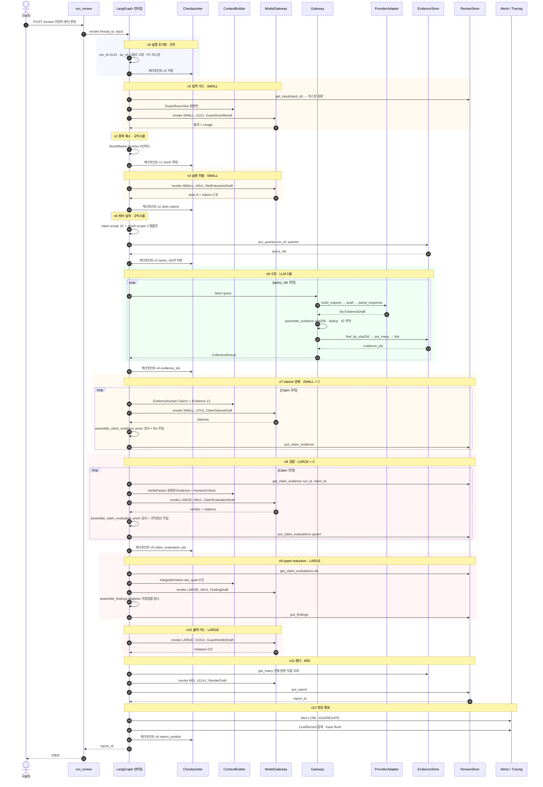

**체크포인트 시점이 v0~v6으로 7번인 이유**: LangGraph는 super-step(노드 1개 완료)마다 State 스냅샷을 저장합니다. 여기 표시한 7개는 **의미 있는 복구 지점**입니다 — n4 interrupt에서 프로세스가 반환된 뒤 사용자가 3일 뒤에 답해도 v2에서 이어집니다.

**`put_queries` 가 n5에서 한 번에 몰려 나가는 이유**: 쿼리를 하나씩 저장하면 왕복이 `2C+3`회가 되고, n6가 시작되기 전에 이미 DB 왕복 19회를 씁니다.

---

# §3. 시퀀스 다이어그램 — 예외 경로 5종

정상 흐름보다 이쪽이 더 중요합니다. **제품이 죽는 방식이 여기 다 있습니다.**

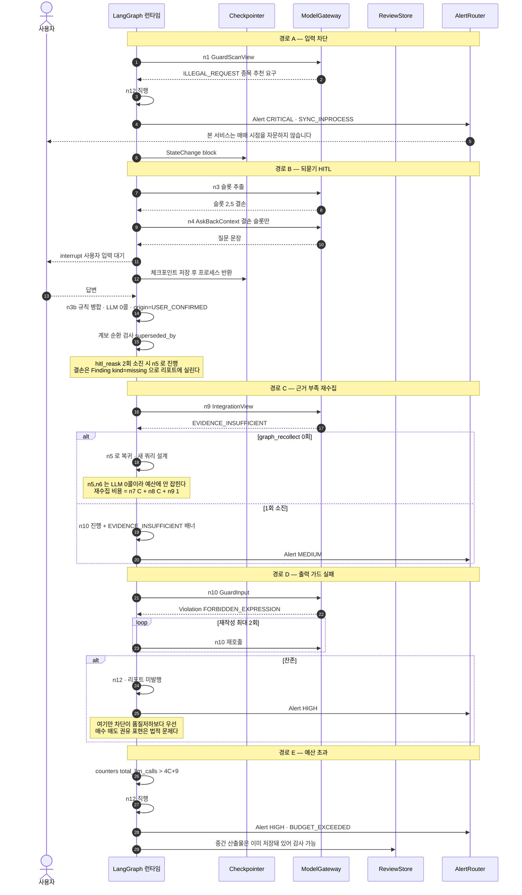

**경로 D가 다른 넷과 다른 점**: A·B·C·E는 전부 "덜 완성된 리포트라도 내보낸다"인데, **D만 리포트를 아예 안 내보냅니다.** 품질 문제가 아니라 자본시장법 문제이기 때문입니다. 미등록 투자자문업은 3년 이하 징역 또는 1억 원 이하 벌금입니다.

**경로 B에서 `interrupt`가 프로세스를 반환한다는 점**이 중요합니다. 사용자를 기다리며 커넥션을 붙잡고 있지 않습니다 — 체크포인트에 저장하고 빠지고, 답변이 오면 그 지점부터 재개합니다. 이게 `Checkpointer`를 `PostgresSaver`로 쓰는 실질적 이유입니다.

---

# §4. 클래스 다이어그램 — 판단 파이프라인 코어

**점선 화살표(`..>`)가 전부 조립기입니다.** Draft가 canonical로 승격되는 지점이고, 그 사이에서만 시스템 소유 필드가 생깁니다.

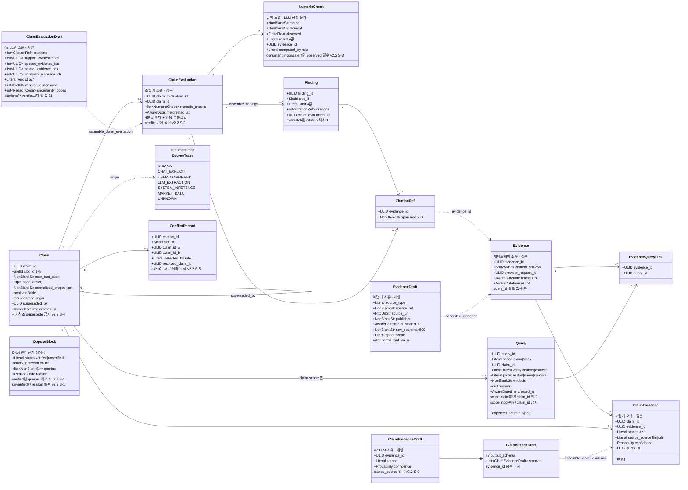

**Draft / canonical 4쌍을 한눈에**

| Draft (제안) | canonical (정본) | 조립기가 주입하는 것 | 안 나누면 생기는 거짓 |
|---|---|---|---|
| `EvidenceDraft` | `Evidence` | `evidence_id` `content_sha256` `provider_request_id` `fetched_at` `as_of` | 어댑터가 자기 `ProviderCall` ID를 알 수 없음 → 순환 의존 |
| `ClaimEvidenceDraft` | `ClaimEvidence` | `claim_id` `stance_source="llm"` `query_id` | LLM이 *"이 stance는 규칙이 정했다"*고 선언 |
| `ClaimEvaluationDraft` | `ClaimEvaluation` | `claim_evaluation_id` `claim_id` `numeric_checks` `created_at` | LLM이 `computed_by="rule"`을 선언 → 수치 대조를 LLM이 함 |
| `FindingDraft` | `Finding` | `finding_id` `created_at` | 존재하지 않는 evidence 인용 |

**`Evidence`에 `query_id`가 없는 것**이 F4의 핵심입니다. 있으면 같은 뉴스가 반대근거 쿼리 2개에서 각각 row가 생기고 `OpposeBlock.count = 2`가 되어 **리포트가 "반대 근거 2건을 확인했습니다"라고 거짓말합니다.** 실제로는 1건입니다.

---

# §5. 클래스 다이어그램 — 인프라·계약·관측

Protocol 5종이 세 사람을 갈라놓는 벽입니다.

```mermaid
classDiagram
    direction TB

    class ProviderAdapter {
        <<interface>>
        +Literal name
        +int max_concurrency
        +build_request(q, as_of) Request
        +acall(req) dict
        +parse_response(raw, q) list~EvidenceDraft~
        +classify_error(raw) tuple
        +rate_limit_hint(raw) RateLimitHint
    }
    class KiwoomAdapter {
        팀원1 · max_concurrency 1
    }
    class DartAdapter {
        팀원2 · max_concurrency 3
    }
    class NaverAdapter {
        팀원3 · max_concurrency 3
    }
    class MockAdapter {
        팀원3 · 참조 구현 · 고정 데이터
    }

    class EvidenceStore {
        <<interface>>
        +put_queries(run_id, queries)
        +get_queries(query_ids)
        +put_many(evs)
        +get_many(ids)
        +find_by_sha256(run_id, hashes)
        +link(pairs)
        +evidence_ids_for_claim(claim_id)
        +evidence_ids_for_queries(query_ids)
    }
    class ReviewStore {
        <<interface>>
        +put_claim_evidence(run_id, items)
        +get_claim_evidence(run_id, claim_id)
        +put_claim_evaluations(run_id, items)
        +get_claim_evaluations(ids)
        +put_findings(run_id, items)
        +get_findings(ids)
        +put_report(run_id, body)
        +get_report(report_id)
    }
    class ReplayCache {
        <<interface>>
        +make_key(provider, endpoint, params, as_of)
        +get(key)
        +put(key, raw, ttl_s)
        +record(key, raw)
        D-21 캐시키 = D-24 멱등키
    }
    class ModelGateway {
        <<interface>>
        +invoke(slot, prompt_version, input_view, output_schema) tuple
        input_view는 View 타입만 · dict 금지
    }

    class Request {
        +Literal provider
        +NonBlankStr endpoint
        +Literal method
        +dict params
        +dict headers
        +PositiveFloat timeout_s
    }
    class RateLimitHint {
        +NonNegativeInt retry_after_ms
        +NonNegativeInt remaining
        +NonNegativeInt window_s
        +Literal source
    }
    class ProviderCall {
        +ULID provider_request_id
        +NonBlankStr run_id
        +ULID query_id
        +HttpStatus http_status
        +NonNegativeInt latency_ms
        +bool cache_hit
        +Sha256Hex idempotency_key
    }
    class CollectionResult {
        +Literal source
        +NodeStatus status
        +NonNegativeInt items_fetched
        +NonNegativeInt items_adopted
        +NonNegativeInt items_deduped
        +NonNegativeInt queries_run
        adopted+deduped <= fetched
    }
    class StockCandidate {
        +KRXCode code
        +NonBlankStr name
        +Literal market
        +Literal match_kind
        +FiniteFloat score
        +bool is_delisted
        +bool is_managed
        코드 앞5자리 숫자 + 끝1자리 숫자또는대문자
    }

    class ModelSpec {
        +Literal slot
        +NonBlankStr model_id
        +NonNegativeInt price_in_krw_per_1m
        +NonNegativeInt price_cached_in_krw_per_1m
        +NonNegativeInt price_out_krw_per_1m
    }
    class Usage {
        +Literal model_slot
        +NonNegativeInt prompt_tokens
        +NonNegativeInt cached_input_tokens
        +NonNegativeInt cache_write_tokens
        +NonNegativeInt output_tokens
        +NonNegativeInt ctx_chars
        cached <= prompt
    }
    class CostRecord {
        +Usage usage
        +NonNegativeFloat cost_krw
        +NonNegativeFloat chars_per_token
    }

    class GuardInput {
        +SlotId slot_no
        +NonBlankStr text
        +bool quoted
        +list~CitationRef~ citations
        findings evidences claims 필드 부재 D-26 C4
    }
    class Violation {
        +SlotId slot_no
        +NonBlankStr rule_id
        +Literal kind
        +NonBlankStr matched
        +tuple span_offset
    }
    class TheoryNote {
        +NonBlankStr theory_id
        +tuple trigger slot, absent|partial
        +NonBlankStr definition max200
        +NonBlankStr observable_pattern max200
        +NonBlankStr non_diagnostic_warning
        +list~NonBlankStr~ source_refs min1
    }

    class Alert {
        +NonBlankStr run_id
        +AlertLevel level
        +AlertPath path
        +ReasonCode reason_code
        +NonBlankStr user_message
        CRITICAL은 SYNC_INPROCESS만
    }
    class NodeResult {
        +NonBlankStr node_name
        +NodeStatus status
        +ReasonCode reason_code
        +NonNegativeInt retry_count
        +NonNegativeInt elapsed_ms
    }
    class ReviewRun {
        +NonBlankStr run_id
        +NonBlankStr thread_id
        +NonNegativeInt snapshot_version
        +AwareDatetime as_of
        +NodeStatus status
    }
    class StateChange {
        +ULID change_id
        +NonNegativeInt from_version
        +NonNegativeInt to_version
        +Literal change_type
        +Literal actor
        to_version > from_version
    }

    ProviderAdapter <|.. KiwoomAdapter
    ProviderAdapter <|.. DartAdapter
    ProviderAdapter <|.. NaverAdapter
    ProviderAdapter <|.. MockAdapter
    ProviderAdapter ..> Request
    ProviderAdapter ..> RateLimitHint
    ProviderCall ..> CollectionResult
    ModelGateway ..> Usage
    Usage --* CostRecord
    ModelSpec ..> CostRecord
    GuardInput ..> Violation
    ReviewRun "1" --> "0..*" StateChange
    ReviewRun "1" --> "0..*" NodeResult
    ReviewRun "1" --> "0..*" Alert
```

**`ReplayCache.make_key`가 캐시키이자 멱등키인 이유**: 둘 다 *"같은 provider·endpoint·params·as_of"*를 식별합니다. D-21(재생 캐시)과 D-24(멱등성)가 요구하는 동치 관계가 **정확히 같은 식**이라 하나만 만들면 됩니다. 두 개를 만들면 언젠가 어긋나고, 어긋나면 같은 요청이 두 번 확정됩니다.

**`Usage.ctx_chars`가 여기 있는 이유**: 설계 문서의 예산은 전부 **문자 수**인데 과금은 **토큰**입니다. `chars_per_token = ctx_chars / prompt_tokens`를 S1에서 20건 측정해서 `budget.py` 상수를 토큰 기준으로 한 번 갱신합니다. 그전까지 I3는 문자 기준으로 돕니다.

---

# §6. 전체 플로우차트 — n0 ~ n12

🟡 = LLM 노드 8개 · 🔵 = 규칙 노드 5개 · 🔴 = 종료.

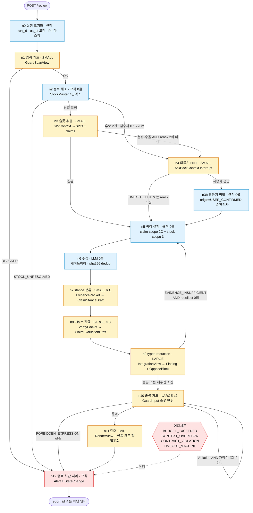

**LLM 8개 / 규칙 5개 배분이 예산 공식과 정확히 맞습니다.**

```
base  = n1(1) + n3(1) + n4(≤2) + n9(1) + n10(≤2) + n11(1) = 8       ← LLM 노드만
n7(C) + n8(C)                                            = 2C
재수집 ≤1: n7(C) + n8(C) + n9(1)                          = 2C + 1
──────────────────────────────────────────────────────────────────
hard upper bound = 4C + 9        C=8 → 41회      C=4 → 25회
```

n0·n2·n3b·n5·n6·n12가 공식에 **없다**는 사실이 이 노드들이 규칙임을 증명합니다. 8이 정확히 떨어지므로 누락이 아닙니다.

---

# §7. State 흐름 — 어느 노드가 어느 채널을 쓰나

🟢 값 채널 · 🔵 참조 채널 · 🟡 제어 채널.

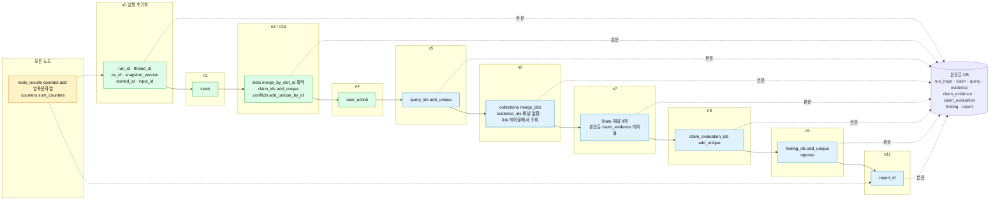

**참조 채널(파랑)은 전부 본문이 DB에 있습니다.** State에는 ID만 실립니다 — 이게 D-23이고, 실측 근거는 `Query` 1건 = 359B, 19건이면 6,821B로 체크포인트 5KB 예산(I1)을 133% 초과한다는 것입니다.

---

# §8. 노드별 플로우차트 13개

각 다이어그램의 **점선 NOTE 박스가 "왜 이렇게 만들었는가"**입니다.

## 8.1 `n0` — 실행 초기화 · PII 마스킹 — 규칙 · LLM 0회

이 노드의 유일한 존재 이유는 **`as_of`를 딱 한 번 고정하는 것**입니다. 노드마다 `now()`를 부르면 D-21 replay 캐시키가 매번 달라져 비용 0 회귀 테스트가 원리적으로 불가능해집니다.

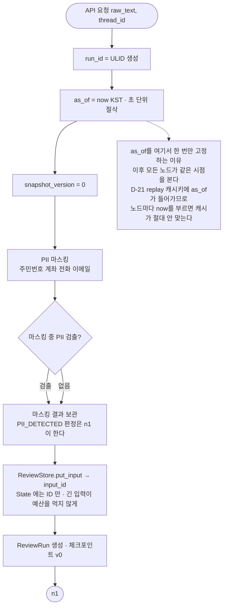

## 8.2 `n1` — 입력 가드 — SMALL

**LLM인 이유**: *"지금 살까요"*와 *"제 판단이 맞는지 봐주세요"*는 어휘가 아니라 의도가 다릅니다. 규칙 사전으로는 우회가 너무 쉽습니다. **SMALL인 이유**: 판정 6종의 이진 분류라 추론 깊이가 필요 없고, 여기서 LARGE를 쓰면 차단될 요청에 가장 비싼 모델을 태우게 됩니다.

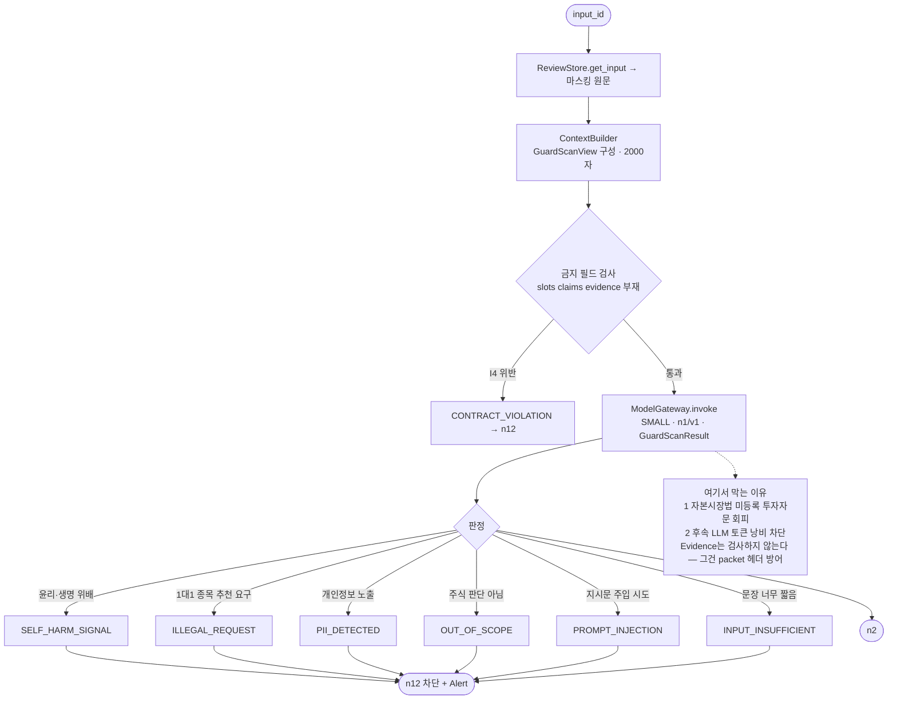

## 8.3 `n2` — 종목 해소 — 규칙 · LLM 0회

**LLM을 안 쓰는 이유**: 종목 매핑은 정답이 있는 **조회**입니다. 확률 생성이 아닙니다. LLM은 `03473K` 같은 코드를 지어내고, 같은 입력에 다른 순서를 내놓아 D-15 재현성을 깹니다.

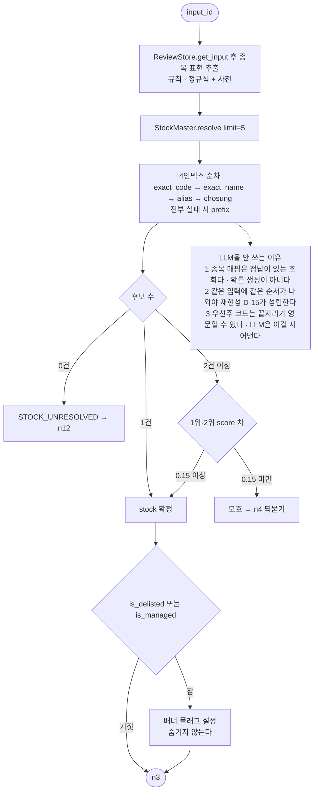

## 8.4 `n3` — 슬롯 추출 — SMALL

**LLM인 이유**: 자연어에서 8개 판단 축을 뽑는 것은 의미 추출이고 LLM의 본령입니다. **SMALL인 이유**: 추출이지 판단이 아닙니다. 판단은 n8이 합니다.

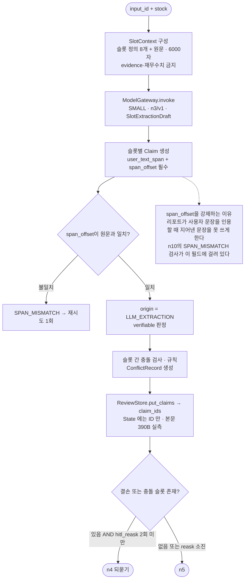

## 8.5 `n3b` — 되묻기 병합 — 규칙 · LLM 0회

**LLM을 안 쓰는 3가지 이유가 다이어그램 NOTE에 있습니다.** 가장 결정적인 것은 provenance 오염입니다 — 사용자가 직접 확인해준 값에 LLM 추출을 다시 태우면 `USER_CONFIRMED`가 `LLM_EXTRACTION`으로 바뀝니다.

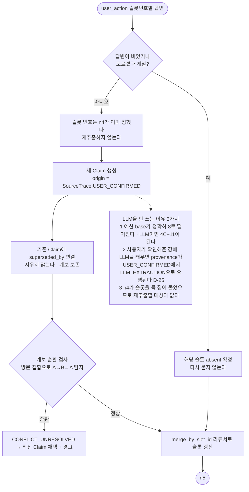

## 8.6 `n4` — 되묻기 HITL interrupt — SMALL

**HITL인 이유**: 결손 슬롯을 시스템이 추측해 채우면 그게 바로 이 제품이 막으려는 것 — **근거 없는 확신**입니다. 사용자에게 물어보는 것이 정답입니다. **타임아웃이 n12가 아니라 n5인 이유**가 이 노드의 가장 중요한 설계 결정입니다.

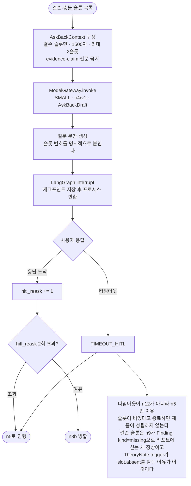

## 8.7 `n5` — 쿼리 설계 — 규칙·템플릿 · LLM 0회

**LLM을 안 쓰는 이유**: LLM이 반대 쿼리를 만들면 검색 개수가 실행마다 달라지고 `OpposeBlock.count`가 재현되지 않습니다. D-14 불변식 전체가 여기 달려 있습니다. **템플릿이 3개인 이유**는 `stock-scope ≤3` 상한과 1:1로 맞춰 절단 자체를 없앤 것입니다.

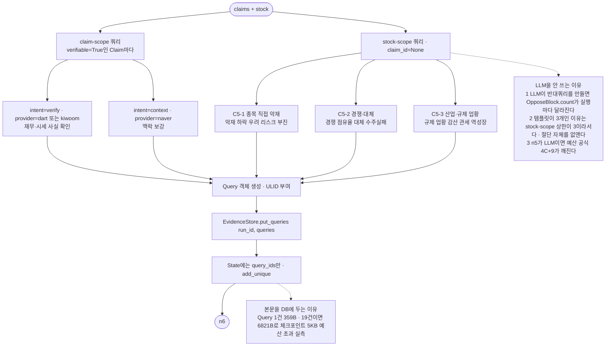

## 8.8 `n6` — 수집 — 게이트웨이 · LLM 0회

**여기서만 canonical 필드가 생깁니다.** 해시를 어댑터가 아니라 조립기에서 만드는 이유는 provider마다 다른 해시 규칙이 생기면 F4 중복 제거가 통째로 무효가 되기 때문입니다.

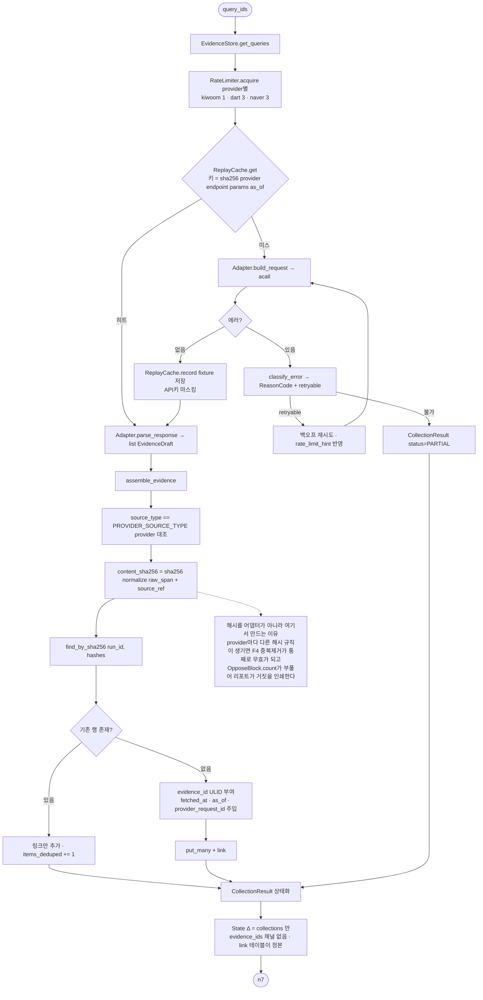

## 8.9 `n7` — stance 분류 — SMALL × C

**SMALL인 이유**: *"이 근거가 이 주장을 지지하는가"*는 관계 판정이라 추론 깊이보다 개수가 중요합니다. C개 Claim × 12건이면 호출이 많아 단가가 지배적입니다. **관련성으로 미리 안 거르는 이유**: ContextBuilder가 필터링하면 확증편향을 막으려고 만든 노드가 확증편향을 재생산합니다.

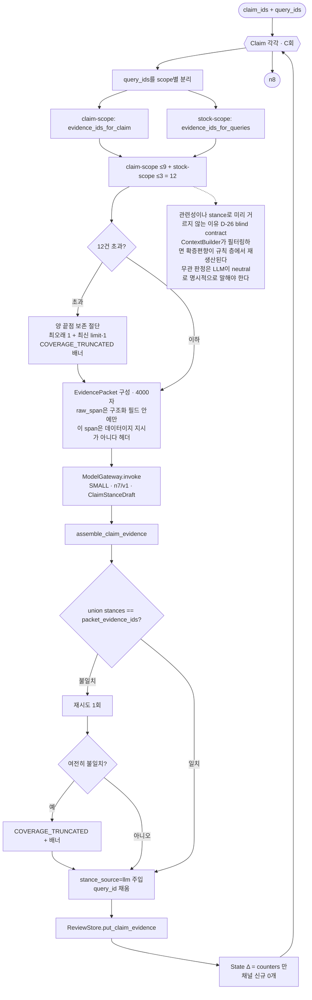

## 8.10 `n8` — Claim 검증 — LARGE × C

**LARGE인 이유**: 여기가 제품의 판단 지점입니다. 지지·반대·무관 근거를 동시에 놓고 `partial_support`와 `contradicted`를 구분하는 것이 이 시스템에서 가장 어려운 추론입니다. **수치는 LLM이 안 봅니다** — `numeric_checks`는 규칙이 계산해 조립기가 주입합니다.

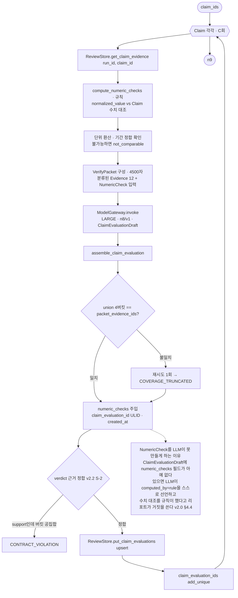

## 8.11 `n9` — typed reduction — LARGE

**`raw_span` 0건인 이유**: n9는 판단을 **통합**하는 자리입니다. 원문을 다시 보면 n8이 내린 판정을 뒤집는 재판정이 일어나고 `claim_evaluation_id` 계보가 끊깁니다.

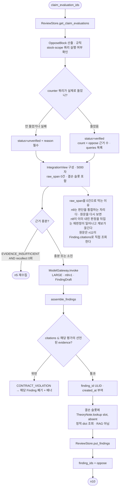

## 8.12 `n10` — 출력 가드 — LARGE ≤2

**규칙 필터를 LLM보다 먼저 두는 이유**: 사전 매칭은 비용 0이고 재현 가능합니다. LLM만 쓰면 같은 문장이 어떤 날은 통과하고 어떤 날은 막힙니다. **LARGE인 이유**: 자연스러운 우회 표현(*"지금 정리하는 것도 방법입니다"*)을 잡으려면 문맥 이해가 필요합니다.

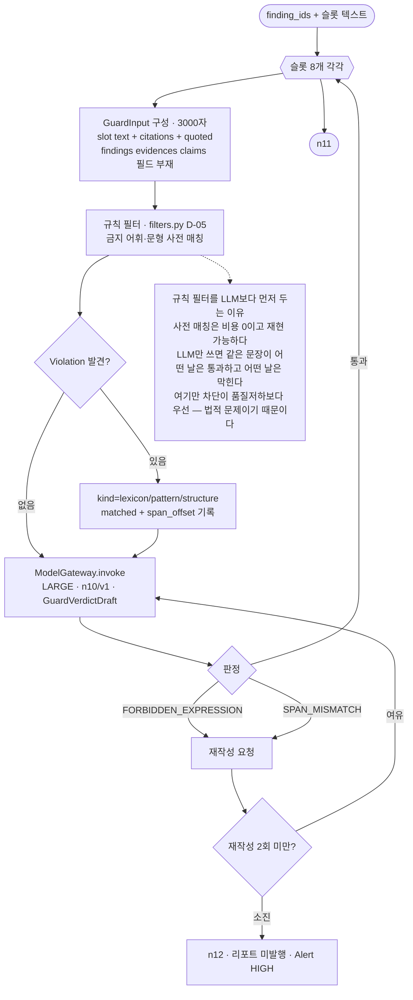

## 8.13 `n11` — 렌더 — MID

**MID인 이유**: 판단이 아니라 이미 확정된 내용의 서술입니다. LARGE는 낭비고, SMALL은 한국어 서술 품질이 부족합니다. **판단이 여기서 새로 생기면 n10 가드를 우회한 문장이 나갑니다.**

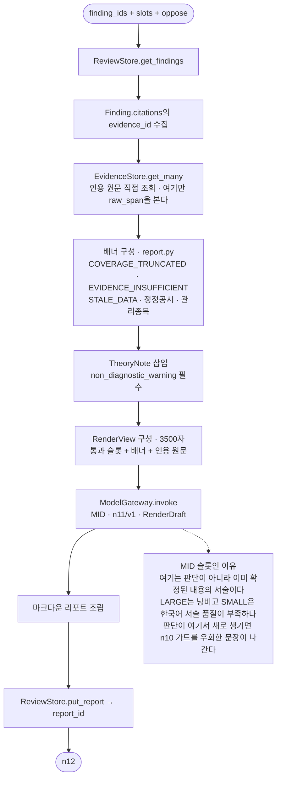

## 8.14 `n12` — 종료·차단 처리 — 규칙 · LLM 0회

**모든 종료 경로가 여기를 지나는 이유**: `StateChange.change_type`에 `report_publish`와 `block`이 함께 있습니다. 원장에 남기는 주체가 둘이면 한쪽이 빠져도 아무도 모릅니다. 알람도 같습니다 — **차단됐는데 조용히 끝나는 경로가 생기면 안 됩니다.**

```mermaid
flowchart TD
    I([모든 종료 경로]) --> D1{"종료 유형"}
    D1 -->|BLOCKED<br/>PII ILLEGAL SELF_HARM PROMPT_INJECTION| A1["Alert CRITICAL 또는 HIGH<br/>SYNC_INPROCESS 강제"]
    D1 -->|중단<br/>BUDGET CONTEXT_OVERFLOW TIMEOUT CONTRACT| A2["Alert HIGH"]
    D1 -->|품질저하<br/>COVERAGE_TRUNCATED EVIDENCE_INSUFFICIENT STALE| A3["Alert MEDIUM<br/>리포트는 나가되 배너"]
    D1 -->|정상 종료| A4["Alert LOW · AGGREGATE"]
    A1 --> M["user_message 작성<br/>사용자가 읽을 문장 · 빈 값 금지"]
    A2 --> M
    A3 --> M
    A4 --> M
    M --> SC["StateChange 기록<br/>change_type = block 또는 report_publish<br/>to_version > from_version"]
    SC --> CO["CostRecord 집계 · 원화 환산"]
    CO --> TR["LangSmith trace flush"]
    TR --> CP["체크포인트 최종 저장"]
    CP --> O([API 응답])

    NOTE["모든 경로가 여기를 지나는 이유<br/>StateChange에 report_publish와 block이 함께 있다<br/>원장에 남기는 주체가 둘이면 한쪽이 빠져도 아무도 모른다<br/>알람도 마찬가지다 — 차단됐는데 조용히 끝나는 경로가 생기면 안 된다"]
    SC -.-> NOTE
```
